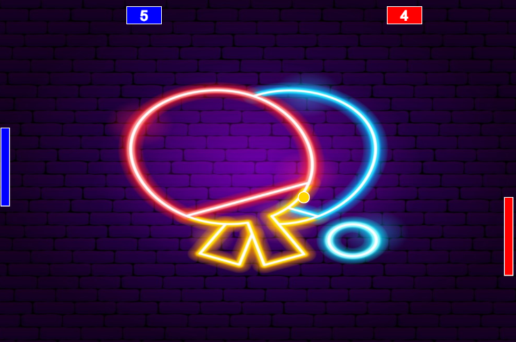

# Pong no Javascript

Este é um projeto do jogo Pong feito no Javascript, durante os cursos da Alura. Peguei o projeto original e fiz modificações no visual e nos sons do jogo, além de correções de alguns bugs.
## Links do projeto
 **Modo CPU (Player 1 vs Computador)**: https://editor.p5js.org/Gabriel_Leme/full/IY40Hw_f6 ;

 **Modo Multiplayer (Player 1 vs Player 2)**: https://editor.p5js.org/Gabriel_Leme/full/4UChbRbst .

 

**Projeto original**:

**Projeto depois das modificações e correções de bugs**:

## Tabela de Conteúdos

- [Meu Processo de Desenvolvimento](#meu-processo-de-desenvolvimento)
- [Tutorial](#tutorial)
- [Recursos Usados](#recursos-usados)
- [Autor do Projeto](#autor-do-projeto)

## Meu processo de Desenvolvimento

Peguei o projeto original do curso e fiz modificações pessoais, adicionei plano de fundo e trilha sonora com a temática retrô, mudei as cores das raquetes e dos placares para azul e vermelho, respectivamente, inseri um texto logo abaixo do jogo com as instruções de como jogar, além de correções de bugs como:

- **Quando a raquete passa da tela**: depois das minhas correções, a raquete não passa mais da borda, quando a raquete vai pra borda de cima ou de baixo, ela é bloqueada pra além da borda;

- **CPU melhorada**: agora o oponente CPU consegue ser mais desafiante, porém não tão difícil, ou seja, uma dificuldade equilibrada;

- **Pontos infinitos**: agora a bolinha dificilmente ficará presa na raquete, gerando pontos infinitos, seja para o oponente ou para o jogador.

## Tutorial

**Modo CPU (1 jogador)**: mover ↑/↓ (setas para cima e para baixo) para mover a raquete;

**Modo Multiplayer (2 jogadores)**: o player 1 usa as teclas W/S para mover a raquete, e o player 2 usa as setas para cima e para baixo (↑/↓) para mover a raquete.

## Recursos Usados

- [P5.js](https://p5js.org/) - foi o site que utilizei para desenvolver o jogo.

## Autor do Projeto

- GitHub - [Gabriel-L-Santos](https://github.com/Gabriel-L-Santos)
- LinkedIn - [Gabriel Leme dos Santos](https://www.linkedin.com/in/gabriel-leme-dos-santos/)